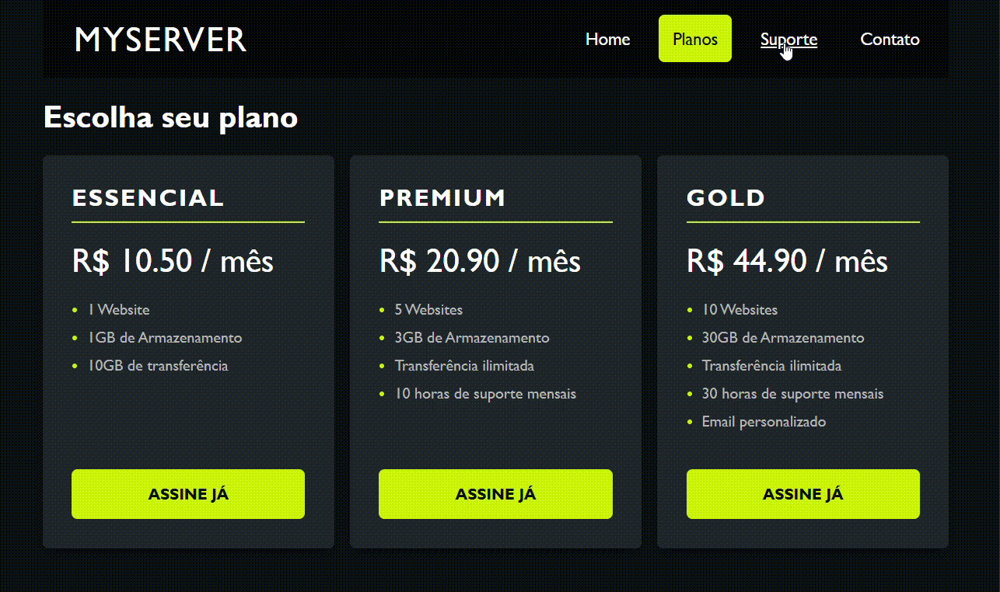

# Price Cards
Fiz um pequeno desenvolvimento de uma página de planos de assinatura com **HTML** e **CSS**. A proposta foi criar uma tela simples, organizada e responsiva para exibir diferentes opções de planos.

## Demonstração

## Tecnologias utilizadas
* HTML5
* CSS3
* Flexbox
* Media Queries
 
